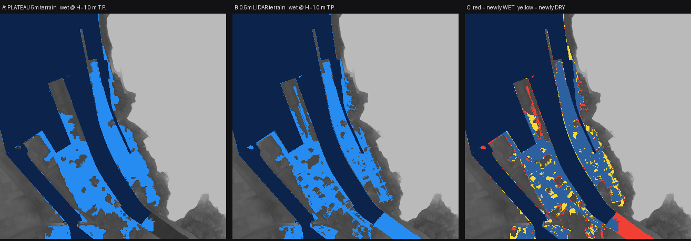

# RESULTS — 解析の結果

実行日: 2026-08-22 / AOI: 舞鶴市 吉原（EPSG:6674, E -61500〜-60500, N -60500〜-59500, 1000 m × 1000 m）
再現手順: `scripts/run_all.sh` / 生データ: `data/out/summary.json`

---

## 要点

水位 **H = 1.0 m T.P.** で、**905 件の PLATEAU 地物のうち 137 件（15.1 %）で
浸水判定が変わった**（PLATEAU 5m 地形 → 0.5m 航空レーザ地形）。

地形条件の定義とパイプラインは `docs/DESIGN.md` §4。ここでは結果だけを示す。

浸水計算は全条件で同一設定: 水位 0.0〜3.0 m T.P. / 刻み 0.05 m / 4 近傍連結 /
seed（開放水面 297,968 m²）は高解像度地形から 1 度だけ求めて全条件で共有。
陸域 702,033 m²。

---

## 面的な差

左=PLATEAU 5m地形の浸水域、中=0.5m地形の浸水域、右=差分（赤=新たに浸水／黄=浸水しなくなる）。

| 水位 [m T.P.] | PLATEAU浸水域 | 高解像度浸水域 | 新たに浸水 | 浸水しなくなる | 浸水深差 p95 | 浸水深差 最大 |
|---:|---:|---:|---:|---:|---:|---:|
| 1.0 | 124,979 m² | 122,733 m² | **19,378 m²** | **21,624 m²** | 0.37 m | 0.95 m |
| 1.5 | 248,833 m² | 252,543 m² | 11,522 m² | 7,813 m² | 0.49 m | 1.31 m |
| 2.0 | 326,390 m² | 326,420 m² | 5,192 m² | 5,163 m² | 0.49 m | 1.80 m |

**浸水面積の合計はほぼ同じでも、場所が大きく違う。** H=1.0 m で陸域の 5.8%（41,002 m²）が
「浸水する／しない」の判定を取り違える。合計面積だけを見ていると差が無いように見える点が重要。

図Bでは水が路地と建物の隙間に沿って指状に入り込むのに対し、図Aは滑らかな塊になる。
南東の岸壁一帯（図Cの大きな赤）は、5m地形では地盤が高く表現されて浸水しないが、
0.5m地形では H=1.0 m で浸水する。

---

## 連結浸水開始水位 h_conn の差

`h_conn` = そのセルが海側と連結して浸水し始める最小水位。全水位の差を1枚で表す指標。

`Δh_conn = h_conn(highres) − h_conn(baseline)`（両方が到達した 1,378,673 セル、陸域のみ）

| 統計 | 値 |
|---|---:|
| p5 | −0.35 m |
| p50 | +0.05 m |
| p95 | +0.30 m |
| \|Δ\| > 0.25 m のセル割合 | **12.7 %** |

0.25 m は京都府DEMの高さ精度の目安（**[未確認]**、国土地理院の類似成果より）。
差の 12.7% はこの目安を超えており、**ノイズでは説明できない。**

### 差の要因分解

| 比較 | 意味 | \|Δh_conn\| > 0.25 m |
|---|---|---:|
| baseline vs highres | 合計 | 12.7 % |
| baseline vs control | **データソースの差**（同じ5m格子どうし） | 10.5 % |
| control vs highres | **解像度の差**（同じデータを5m/0.5m） | 3.4 % |

**差の主因は解像度ではなくデータソース**（PLATEAUの5m地形 vs 航空レーザ計測）。
これは当初の「解像度が効く」という見立てとは異なる、実測から得られた重要な知見。
解像度も 3.4% 分は寄与しており、両方が効いている。

---

## 地物単位の結果

PLATEAU の 911 地物（建物 694 / 道路 217）に assertion を付与。
うち 6 件は橋梁・高架橋（`uro:RoadStructureAttribute.sectionType` = 2/3/5/6）で
路面が地表面と一致しないため除外し、**905 件**を評価対象とした。

| 水位 [m T.P.] | 判定変化 | うち建物 | うち道路 | PLATEAU非浸水→高解像度で浸水 | PLATEAU浸水→高解像度で非浸水 | 道路の通行支障クラスのみ変化 |
|---:|---:|---:|---:|---:|---:|---:|
| 1.0 | **137** | 80 | 57 | 10 | 72 | 55 |
| 1.5 | 32 | 15 | 17 | 3 | 15 | 14 |
| 2.0 | 25 | 12 | 13 | 6 | 8 | 11 |

いずれかの水位で判定が変わる地物: **191 件 / 905 件（21.1%）**

### 地盤高の差（highres − baseline, 905地物）

| 統計 | 値 |
|---|---:|
| 平均 | +0.02 m |
| p5 | −0.27 m |
| p50 | +0.04 m |
| p95 | +0.27 m |
| \|Δ\| > 0.25 m の地物割合 | **12.0 %** |

平均はほぼ0（系統的なバイアスは無い）だが、**個々の地物では ±0.3 m 規模でばらつく。**
高潮の水位分解能を考えれば、この差は判断を変える大きさ。

### 判定が変わった地物の例（H = 1.0 m T.P.）

| gml_id | 種別 | 地盤高 baseline | 地盤高 highres | 浸水深 baseline | 浸水深 highres |
|---|---|---:|---:|---:|---:|
| `tran_9820998c-2b84-4764-a3ad-85585e6f1d55` | tran:Road | 1.677 m | 0.500 m | 0.00 m | **0.50 m** |
| `bldg_d8ca2c88-656e-4c3e-a291-f32559594754` | bldg:Building | 1.449 m | 0.400 m | 0.00 m | **0.60 m** |
| `bldg_c92a65b8-a46e-47cc-9e60-6f507401e292` | bldg:Building | 1.408 m | 0.400 m | 0.00 m | **0.60 m** |
| `bldg_a3bfa4fc-ae85-4332-8133-c8f53bb2e55a` | bldg:Building | 1.040 m | 0.330 m | 0.00 m | **0.67 m** |
| `bldg_65b0182d-021c-400c-9d7f-032912b09079` | bldg:Building | 0.911 m | 1.400 m | 0.09 m | 0.00 m |

`h_conn` の差が最も大きい地物（= 判定が変わる水位帯が最も広い）:

| gml_id | 種別 | h_conn baseline | h_conn highres | Δ |
|---|---|---:|---:|---:|
| `tran_0d292f76-4481-4363-acff-823dbc4aaa0c` | tran:Road | 0.00 m | 1.90 m | +1.90 m |
| `tran_2e00e449-0f84-4c0e-b35c-3512a90a428c` | tran:Road | 1.95 m | 0.45 m | −1.50 m |
| `tran_81ccd1f9-142a-4e9f-b19c-13d1da526687` | tran:Road | 1.85 m | 0.45 m | −1.40 m |
| `bldg_0fc944e4-4530-4031-9e21-5dbc9d6614c3` | bldg:Building | 0.00 m | 1.25 m | +1.25 m |

---

## 実装上の知見

1. **PLATEAU の地形モデルは 5m 格子 TIN**（実測: 頂点間隔 5.00〜5.05 m、標高 0.05 m 刻み）。
   ファイルサイズは舞鶴市全域で 10.5 GB あるが、情報量は 5m 格子相当。
   三角形補間はせず頂点を 5m 格子に集約するだけで十分。
2. **h_conn（連結浸水開始水位）を1枚持つ設計が有効。**
   水位スライダを動かすたびに flood fill を回す必要がなく、
   `wet(H) = h_conn <= H` / `depth(H) = max(0, H−E)` の2式で済む。
   Webでもシェーダで評価でき、サーバ計算が不要になる。
3. **seed（開放水面）は地形ごとに求めてはいけない。** 高解像度地形から1度だけ求めて共有する。
   でないと比較が seed の差に汚染される。seed は「常に水位Hの開境界」として標高 −inf 扱いにする。
4. **建物の地盤高は footprint 内部から取ってはいけない。** 京都府DEMは建物除去済みで、
   内部は補間ゴースト。外周 1 m リングの 10 パーセンタイルを使う。
5. **PLATEAU の意味情報が地形解析の品質管理に直接効く。**
   `uro:RoadStructureAttribute.sectionType`（1 土工区間 / 2 高架橋 / 3 橋梁 / 4 交差部 /
   5 アンダーパス / 6 トンネル）で、DTM由来の地盤高が無意味な地物を機械的に除外できた。
   これを使わないと、橋の上の道路が「水面標高 0.3 m の地盤」として集計され、
   判定変化の上位に偽陽性が並ぶ（実際に最初はそうなった）。
   **これが「PLATEAU = semantic city model / 点群 = terrain observation」と役割分担する具体的な効き目。**
6. 京都府DEMの図郭 `06LC` / `06MC` の境界が AOI を横切る。
   PLATEAU の dem も 2次メッシュを 4 象限に割ったファイル構成で、AOI が象限境界をまたぐ。
   **どちらも「1ファイルで足りる」と思い込むと AOI の一部が欠測する**（実際に一度やった）。
7. 図郭zipは 3.7〜10.7 GB だが、HTTP Range で必要タイル（各12 MB）だけ取れる。全体を落とす必要はない。

---

## 実際の潮位で見るとどうなるか

`docs/DATA.md` §4 で **[未確認]** だった潮位を確定させた（`scripts/86_tide_levels.py`）。

| 基準水位 | H [m T.P.] | 判定が変わる地物 / 905 |
|---|---:|---:|
| 平均水面 | 0.124 | 0 |
| 朔望平均満潮位（近似） | 0.439 | 14 |
| 天文潮の最高 | 0.484 | 26 |
| **既往最高潮位**（1998-09-22 台風7号） | **0.930** | **95 (10.5%)** |

**舞鶴で実際に記録された最高潮位で、905 地物中 95 件の判定が変わる。**
浸水する地物の総数は PLATEAU 地形 406 件 / 高解像度地形 405 件とほぼ同じで、
**総数だけ見れば差が無いように見えるのに、中身が 95 件違う。**

本文の H = 1.0 m は当初は根拠のない代表値として選んだものだったが、
既往最高潮位 0.93 m のすぐ上にあたる。結果の意味づけとしては妥当な水位だった。

---

## 実点群を入れるとどうなるか

舞鶴・吉原のバックパック SLAM 点群 10 本（20.0 GB / 4.98 億点、2026-07 取得）が届いたので、
`docs/DATA.md` §3 の想定どおり地形観測を差し替えて再評価した。

### 点群は DEM の置き換えにならなかった **[実測]**

| 項目 | 実測値 |
|---|---|
| AOI（100 ha）に占める被覆 | **7.88 ha (7.9%)** — 歩いた線に沿った帯だけ |
| 被覆域の密度 | **5,539 点/m²**（0.5m セルあたり中央値 169 点） |
| 地面として使えたセル | **3.17 ha (3.2%)** — 壁面・軒下しか見ていないセルを除いた後 |

> **10 本すべてを使うまでの経緯 [実測]**
> ⑨ は PDAL が `EVLR 1(/64139) size too large -- exceeds file size` で開けず、
> 当初 9 本だけで解析・配信していた。原因はファイル側の破損で、ヘッダが
> 「EVLR が 1 個、オフセット 2,108,160,159」と宣言しているのに、そこにあるのは
> 61 バイトのゴミ（宣言長 68,719,476,737 B = ファイルの 32 倍）だった。
> 点データ終端はちょうど 2,108,160,159 で、**点 58,559,994 点は無傷**。
> 原本には触れず、EVLR 宣言を 0 にした修復コピーを作って読んでいる
> （`scripts/24_repair_las_evlr.py`）。⑨ を足すと被覆は 7.13 → 7.88 ha、
> 使える地表面は 2.98 → 3.17 ha になった。

**バックパック SLAM は面ではなく線で取る。** AOI 全域の 0.5m DTM は作れない。
そこで **点群がある所だけ 0.5m DEM を上書きする融合**にした（`scripts/19_pc_dtm_fuse.py`）。

### 点群は 0.5m DEM を裏付けた **[実測]**

融合前に両者を突き合わせた（`scripts/18_pc_vs_dem.py`）。開けた平地のセルだけで比較:

| 量 | 値 |
|---|---:|
| 鉛直バイアス（点群 − DEM の中央値） | **+0.002 m** |
| MAD | **0.069 m** |

**鉛直基準は一致している。** ジオイド補正もシフトも要らない。
航空レーザ（2019-2023）と地上 SLAM（2026-07）が 7 mm で合うのは、
両者がそれぞれ妥当であることの相互確認になっている。
**バイアスは実測して記録しただけで、補正はしていない。**

### 判定はほとんど変わらなかった **[実測]**

同一水位での浸水判定（`scripts/40_compare.py`, `scripts/20_pc_object_impact.py`）:

| 比較 | \|Δh_conn\| > 0.25 m のセル | H=1.0 m での新規浸水 / 非浸水 |
|---|---:|---|
| PLATEAU 5m vs 0.5m DEM | 12.7 % | 19,378 / 21,624 m² |
| **0.5m DEM vs 点群融合** | **0.44 %** | **330 / 1,544 m²** |

地物単位（905 件、既往最高潮位 T.P.+0.93 m）:

| 比較 | 判定が変わる地物 |
|---|---:|
| PLATEAU 5m → 0.5m DEM | **95 件** |
| 0.5m DEM → 点群融合 | **18 件** |

**大半の価値は航空レーザ 0.5m DEM の時点で既に得られていた。**
地上点群が足すのは、その上に乗る 1 桁小さい補正である。

### ただし護岸帯では大きく食い違う **[実測]**

点群が最も効くはずの場所＝水際から 6 m 以内の護岸帯で比べると
（`scripts/21_pc_crest_impact.py`）:

| 量 | 値 |
|---|---:|
| 護岸帯のうち点群が入っているセル | **0.209 ha**（帯全体 2.885 ha のごく一部） |
| 点群 − DEM の中央値 | +0.020 m |
| p05 / p95 | **−0.604** / +0.219 m |
| \|差\| > 0.10 m のセル | **39.8 %** |

**被覆できた護岸帯では 4 割のセルが 10 cm 以上違い、点群の方が低く出る側に裾を引く。**
航空レーザが水際の細い段差・雁木・スロープを均してしまうのに対し、
地上から至近距離で測った点群はそれを拾っている。

その結果、内陸側の防護レベル（h_conn の p05）は **0.85 → 0.70 m** に下がった。
一方で**越流開始水位は 0.25 m のまま変わらない** — 最も低い越流地点が
点群の被覆に入っていないためで、点群が良いか悪いかの話ではない。

### まとめると

1. **0.5m DEM は妥当だった。** 地上点群が 7 mm / MAD 6.5 cm で裏付けた。
2. **判定を大きく変えるのは依然として PLATEAU 5m → 0.5m の段差**（95 件）で、
   地上点群が足すのは 18 件。
3. **ただし歩けた護岸帯に限れば 4 割が 10 cm 以上違う。**
   点群の価値は「面を測り直すこと」ではなく
   「連結性を決めている細い構造を測り直すこと」にある。
4. そのためには **越流地点を歩く**必要がある。
   今回の被覆は越流開始地点を外していた。次に測るならそこを狙う。

---

## この結果の限界

手法そのものの限界は `docs/DESIGN.md` §8（静水位モデル、暗渠・樋門を考慮しない、
京都府 DEM が森林資源把握目的の成果である、など）。**ここでは、この結果を読むときに
直接効くものだけを挙げる。**

- **AOI が 1 km 四方の 1 地区**。他地区に一般化できる保証は無い。
  吉原は「微地形が効くことを期待できる典型」として選んだので、**効きやすい側に偏っている。**
- **点群が覆うのは AOI の 7.88 %、地表面として使えるのは 3.17 %**。
  点群条件の結論は、この狭い範囲についてのものである。
- **`control` は平均集約であって、5 m 実測地形ではない。** 解像度効果の
  切り分けは「0.5m を粗くしたらどうなるか」であり、
  「別の 5 m 実測があったらどうなるか」ではない。
- 設計高潮位 / 計画高潮位が **[未確認]** なので、**水位 H に行政上の意味づけが無い**。
  既往最高潮位 T.P.+0.93 m と京都府の想定基準潮位 T.P.+0.69 m は確定している。

---

---

次に何をするかは `docs/TODO.md`。
