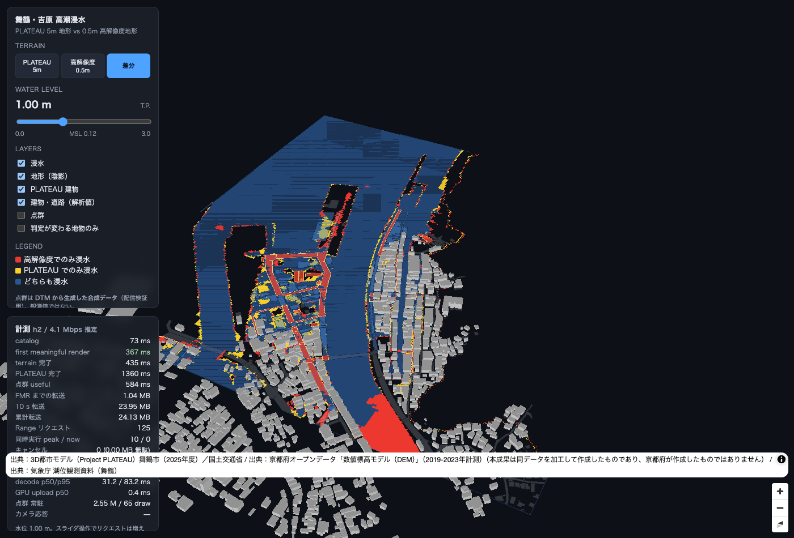
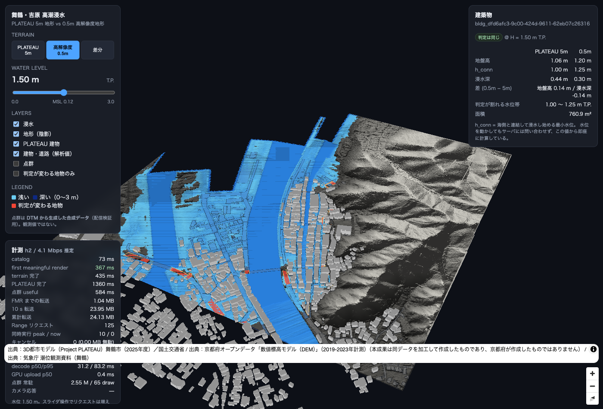
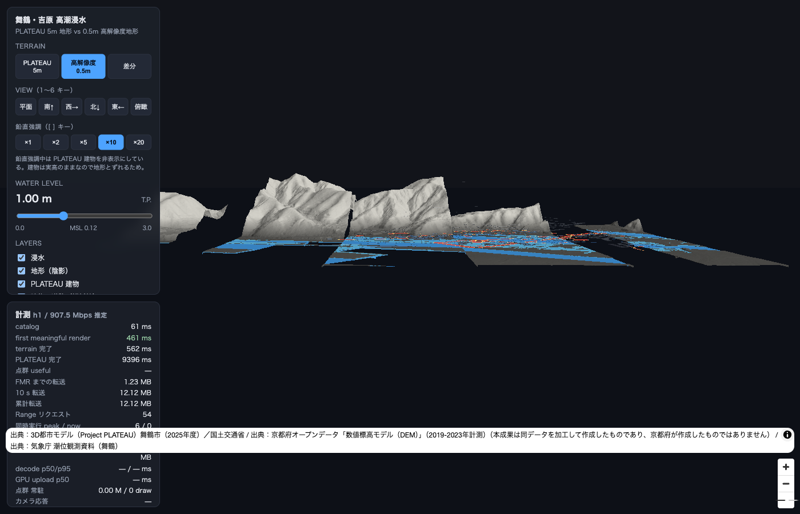
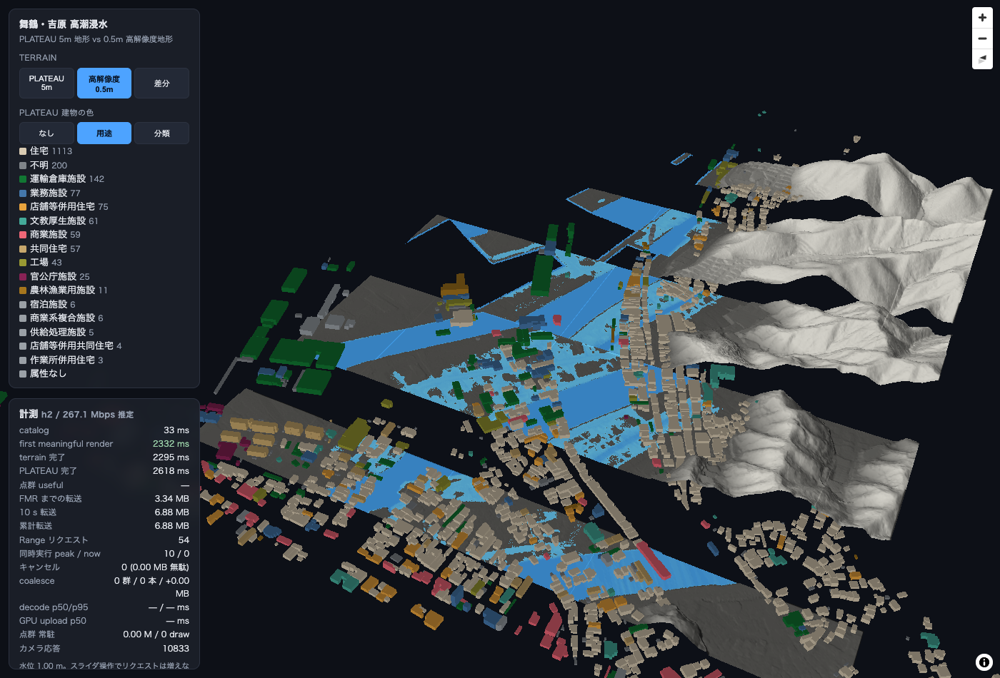
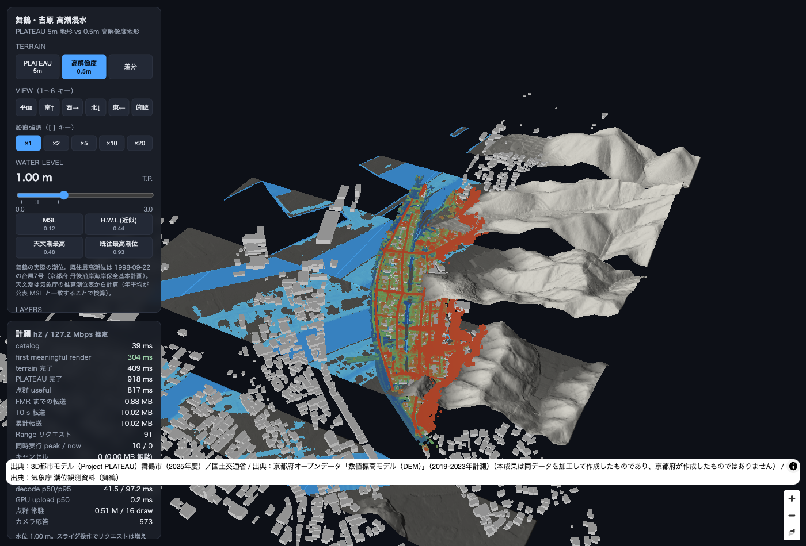

# WEB_RESULTS — ネットワーク実測

`docs/WEB_DESIGN.md` の設計で最小 vertical slice を実装し、cold cache で計測した結果。
再現: `cd web && npm run build && node serve.mjs` を別プロセスで起動して `node perf/run.mjs`。
生データ: `web/perf/results/*.json`。

計測日: 2026-08-22 / macOS / Chromium (Playwright 1.62, headed = 実 GPU) /
ビューポート 1100×750 / 配信は同一オリジン HTTP/2 + TLS、Range 206、br 事前圧縮。

---

## 0. 何を測ったか

FPS は測っていない。測ったのは「いつ・何バイトで・何が見えたか」（`docs/WEB_DESIGN.md` §8）。

`first_meaningful_render` = **視野を覆う最小ズーム（z14–15）の terrain+h_conn タイルが
GPU に乗り、浸水色が 1 フレーム描かれた時刻**。高ズームの到着は待たない。

ネットワークプロファイル（本リポジトリ定義。DevTools プリセットそのものではない）:

| profile | down | up | RTT |
|---|---|---|---|
| `normal` | 無制限 | 無制限 | 0 ms |
| `fast4g` | 4 Mbps | 3 Mbps | 70 ms |
| `slow-highrtt` | 1 Mbps | 0.5 Mbps | 400 ms |
| `fatpipe-highrtt` | 20 Mbps | 5 Mbps | 400 ms |

`fatpipe-highrtt` は当初は用意していなかった。§4 で range coalescing の効果を
「帯域律速」から切り離すために後から足した。

配信するアセットの総量は **40.8 MB**（タイル 4.45 / 3D Tiles 21.3 / COPC 14.5 / GeoJSON 0.57）。

---

## 1. 最大の発見 — ボトルネックは地理データではなく JS バンドルだった

最初の実測で `slow-highrtt` は **12 秒以内に一度も描画されなかった**。
発行されたリクエストは `catalog.json` の 1 本だけ。
つまり地形タイルを取りに行く前に、アプリの JS を落とすところで時間を使い切っていた。

対処として、初回描画に不要な module を動的 import に切り出した。

| 切り出したもの | サイズ (gzip) |
|---|---|
| `@loaders.gl/3d-tiles` + `Tile3DLayer`（`view/plateau.ts`） | 98.6 kB |
| `copc` + `laz-perf` + decode worker + point cloud renderer（`pointcloud/lazy.ts`） | 29.5 kB + worker 133 kB |
| 初期チャンク | 610 kB → **522 kB** |

結果:

| profile | FMR 前 | FMR 後 | FMR までの転送 前 | 後 |
|---|---:|---:|---:|---:|
| normal | 624 ms | **351 ms** | 4.17 MB | **0.74 MB** |
| fast4g | 1,504 ms | **881 ms** | 2.58 MB | **0.64 MB** |
| slow-highrtt | **描画されず（>12 s）** | **3,149 ms** | — | **0.64 MB** |

**FMR までの転送量が 4.17 MB → 0.74 MB になり、全プロファイルでほぼ一定になった。**
クリティカルパスが「初期チャンク + catalog + 粗タイル 4 枚」に確定したということ。

`slow-highrtt` が「描画されない」から「3.1 秒」になったのは、
優先度クラスの設計ではなく **バンドル構成**で決まっていた。
COPC や 3D Tiles をいくら賢く並べても、その手前で詰まっていた。

> **「COPC + HTTP Range を採用した」ことは、ネットワーク問題の解決を何ひとつ意味していなかった。**
> 一番効いた対策は、フォーマットでも scheduler でもなく `import()` の位置だった。

---

## 2. プロファイル別の実測（コード分割後）

| profile | FMR ms | terrain ms | PLATEAU ms | 点群 useful ms | MB→FMR | MB@10s | reqs | peak 並列 | cancel | 無駄 MB | coalesce 群/本 | decode p50 | 水位31段のreq | カメラ応答 ms |
|---|---:|---:|---:|---:|---:|---:|---:|---:|---:|---:|---|---:|---:|---:|
| normal | **351** | 664 | 1,447 | 1,023 | 0.74 | 20.23 | 63 | 10 | 0 | 0.00 | 4/42 | 34.3 | **0** | 480 |
| fast4g | **881** | 2,733 | — | — | 0.64 | 3.70 | 54 | 11 | 0 | 0.00 | 3/11 | 27.1 | n/a | 237 |
| slow-highrtt | **3,149** | — | — | — | 0.64 | 0.97 | 23 | 11 | 0 | 0.00 | 0/0 | — | n/a | 235 |

「—」は 12 秒の計測窓内に到達しなかったもの。**それ自体が結果**であって欠測ではない。

読み取れること:

1. **progressive loading は成立している。**
   `fast4g` では 0.88 秒で浸水図が出る。PLATEAU も点群も来ていないが、
   「解析結果は点群全ロードを待たずに表示する」という要件は満たしている。
2. **`slow-highrtt`(1 Mbps/400 ms) では 12 秒あっても terrain の高ズームまで届かない。**
   MB@10s = 0.97 MB は帯域上限そのもの。ここは設計ではなく物量の問題で、
   AOI 全体を出すこと自体を諦めて視野を絞る（LOD を浅く止める）方向でしか改善しない。
3. **同時実行は設計どおり 10〜11 で頭打ち**（h2 の global cap 12）。
   `nextHopProtocol` から h2 を検出して上限を切り替える経路が効いている。
4. **水位スライダ 31 段の掃引で発行リクエスト = 0**（`normal`）。
   h_conn を 1 枚のテクスチャに持ち、シェーダの uniform だけ書き換える設計の狙いどおり。
   スロットル下は初期ロードが 8 秒以内に静止せず `n/a`（測定条件を満たさないため未計測）。

---

## 3. COPC の range coalescing

LOD selection が選んだノードを `pointDataOffset` でソートし、
gap < 64 KiB・合計 ≤ 4 MiB なら 1 本の Range にまとめる（`src/net/coalesce.ts`）。

`normal` では **4 群にまとめて 42 ノード**を取得した。
COPC のノードはファイル上でほぼ連続して並ぶため、
**まとめても「読むが使わないバイト」は 0.00 MB** だった（`extraBytes = 0`）。

つまりこの条件では coalescing は **ほぼ無損失で往復回数を 42 → 4 に減らしている**。
RTT が支配的な回線ほど効くはずで、実際 §4 の比較でそれを確認した。

R2 はマルチレンジ（`bytes=a-b, c-d`）に 400 を返すため、
飛び地の結合はできない。連続 1 レンジへの結合だけが使える。

---

## 4. coalescing の on/off 比較 — 一度は否定し、原因を直したら反転した

`docs/WEB_DESIGN.md` §4.4 では「高 RTT ではリクエスト数が支配的になるので coalescing が効くはず」
と書いた。**実測はこれを支持しなかった。**

| 配信 | profile | coalesce | COPC リクエスト数 | 点群 useful ms | terrain ms |
|---|---|---|---:|---:|---:|
| HTTP/2 | fast4g (4 Mbps/70 ms) | on | 3 群 / 11 本 | — | 2,727 |
| HTTP/2 | fast4g | off | 11 本 | 8,357 | 2,727 |
| HTTP/2 | slow-highrtt (1 Mbps/400 ms) | on | 0（開始前に窓終了） | — | — |
| HTTP/2 | slow-highrtt | off | 0 | — | — |
| HTTP/2 | **fatpipe-highrtt** (20 Mbps/400 ms) | on | **6 本**（3 群 / 11 ノード） | 6,978 | 2,768 |
| HTTP/2 | **fatpipe-highrtt** | off | **14 本** | **5,745** | 2,726 |
| HTTP/1.1 | fatpipe-highrtt | on | **6 本** | 5,802 | 3,976 |
| HTTP/1.1 | fatpipe-highrtt | off | **14 本** | 5,506 | 4,017 |

**リクエスト数は狙いどおり 14 → 6 に減る。時間はまったく縮まらない**（むしろわずかに遅い＝誤差範囲）。

理由は素直に説明がつく:

- 点群フェーズは **帯域律速**であって RTT 律速ではない。
  COPC 約 10 MB を 20 Mbps で運べば最短でも 4 秒かかる。
  節約できる往復は最大でも数 RTT（2 秒未満）で、しかも並列化で吸収されている。
- HTTP/2 では多重化が往復を最初から償却している。
  HTTP/1.1（同時 6 本）でも結果は変わらなかったので、
  「h2 だから効かなかった」という説明も成り立たない。
- ノード数が **11〜14 本しかない**。この規模では往復の総数がそもそも小さい。

さらに **coalescing は「最初の点が出るまで」を確実に遅らせる**。
`rangeFetch` は 1 リクエスト分のバイトが全部届いてから resolve する（§4.2）。
束ねた range は、その中の 1 ノードだけ欲しくても**全部届くまでデコードが始まらない**。
上表で coalesce=0 の方が「点群 useful」に毎回先に届いている（8,357 / 5,745 / 5,506 ms vs
未到達 / 6,978 / 5,802 ms）のは誤差ではなく、この機構で説明がつく。

**一次結論（当時）**: coalescing は既定 OFF。リクエスト数は減るが時間の利得が無く、
最初の点はむしろ遅い。

### 4.1 原因を直したら結論が反転した

上の「最初の点が遅れる」は §4.2 の「1 リクエスト内をストリーミングしていない」ことが原因だった。
そこで **まとめた range を、届いた分から順にノード単位でデコードする** ようにした
（`FetchTask.parts` / `onPart` → `Scheduler` → `PointCloudController.decodeAndShow`）。

同じシナリオを測り直した結果（`web/perf/results/coalesce-stream.json`）:

| 配信 | profile | coalesce | 点群 useful ms | リクエスト数 |
|---|---|---|---:|---:|
| HTTP/2 | fatpipe-highrtt | **on** | **5,343** | 61 |
| HTTP/2 | fatpipe-highrtt | off | 5,494 | 66 |
| HTTP/2 | fast4g | **on** | **7,797** | 52 |
| HTTP/2 | fast4g | off | 9,286 | 57 |

**ストリーミング前は coalesce=on が毎回遅かったのが、両プロファイルで速い側になった。**
`fast4g` では **1.5 秒（16%）短縮**。リクエスト数も 57 → 52 に減っている。

→ **coalescing は既定 ON に戻した**（`?coalesce=0` で無効化できる）。

**注意**: 1 プロファイル 1 試行のままなので、`fatpipe-highrtt` の 151 ms 差は
ばらつきと区別できない。断定できるのは `fast4g` の 1.5 秒差と、
**「ストリーミング前は必ず遅かった側が、必ず速い側になった」という符号の反転**まで。

この一件は、**最適化そのものではなく、その前提（1 リクエスト内の逐次処理）が
欠けていたために効果が出ていなかった**という例。
実測で否定 → 機構の欠落を特定 → 直して再測 で結論が変わった。

### 4.2 ストリーミングの現状

| 粒度 | progressive か |
|---|---|
| タイル / b3dm / COPC ノード群 ごと | **はい**。届いた順に描画される |
| **まとめた 1 リクエストの中（COPC）** | **はい（実装した）**。Range 長が確定しているので受信バッファを事前確保し、各ノードの終端オフセットを越えた時点でそのノードだけ切り出して decode worker に渡す |
| `objects.geojson`（560 kB） | **いいえ**。単発取得 + 一括 `JSON.parse`。ここは未対応 |
| 単一の大きなアセット（b3dm など） | **いいえ**。ファイル単位取得なので分割する意味が薄い |

実装の要点:

- `rangeFetch` に `onData(buf, received)` を足した。**Range 要求のときだけ**
  長さが確定するので事前確保でき、「届いた分までのバッファ」をそのまま渡せる。
  `content-encoding` で受信量が Range 長を超えた場合は事前確保をやめて積み直す
  （バイナリを圧縮して返す配信に当たったときの保険）。
- `Scheduler` は `FetchTask.parts` の終端オフセット順に、越えたものから `onPart` へ払い出す。
  メモリキャッシュにヒットした場合も同じ順で払い出して呼び出し側の分岐を無くしている。
- 点群側は 1 ノード届くごとに decode → `renderer.upsert([chunk])` するので、
  **画面にも 1 ノードずつ増えていく**。

> これは「COPC + HTTP Range を採用しただけで性能検証を終わらせない」という
> 方針が、**自分が提案した最適化を否定する形で**働いた例。
> `extraBytes = 0` で無損失なので入れたままにするが、**効果があるとは書かない。**

### 4.1 HTTP/2 と HTTP/1.1

同じ `fatpipe-highrtt` での比較（`node serve.mjs --http1 --port=8080`）:

| | h2 | h1 |
|---|---:|---:|
| 同時実行 peak | 11 | 6（`nextHopProtocol` から判定して上限を切替） |
| terrain 完了 | 2,768 ms | **3,976 ms** |
| FMR | 1,100 ms | 1,006 ms |
| PLATEAU 完了 | 10,296 ms | 10,099 ms |

**多数の小さいタイルを取る terrain フェーズだけが h1 で 1.2 秒遅い。**
FMR（4 枚）や PLATEAU（22 ファイル）は差が出ない。
`Scheduler.detectProtocol()` が h1/h2 を判定して上限を切り替える経路は実際に効いている。

---

## 5. キャンセルと無駄バイト — **実装バグが 2 つあった**

当初はどのプロファイルでもキャンセル 0 件で、「テストのカメラ操作が穏やかすぎるため」
と書いた。**違った。** 大きくズームアウト・対角へジャンプする
シナリオ（`node perf/run.mjs --scenario=cancel`）を足しても **0 件のままだった。**
調べたらキャンセル判定そのものが機能していなかった。

| # | バグ | 影響 |
|---|---|---|
| 1 | 点群の `stillNeeded` が **発行時の wanted 集合をクロージャに閉じ込めていた** | その集合は永久に変わらないので常に `true`。点群は一度もキャンセル対象にならない |
| 2 | 地形タイルに `epoch` も `stillNeeded` も**付けていなかった** | `stale()` は `epoch === undefined` で即 `false`。地形タイルも一度もキャンセルされない |

`docs/WEB_DESIGN.md` §4.5 で「epoch が古いだけでは切らない」という防御を設計したが、
**その防御の相方（『いまも必要か』を答える関数）を実装していなかった。**
設計だけ読むと正しく、コードだけ読むと動かない、という組み合わせだった。

修正後（同じシナリオ、cold cache）:

| profile | キャンセル | 無駄バイト | terrain 完了 |
|---|---:|---:|---:|
| fast4g | **26 件** | 0.00 MB | 2,613 → **1,114 ms** |
| fatpipe-highrtt | **31 件** | 0.00 MB | 2,491 → **1,107 ms** |

- キャンセルは全て `terrainFine`。**すべて送信開始前にキュー段階で破棄**されたので
  無駄バイトは 0。受信途中で切った例はこのシナリオでは発生していない。
- **副作用として terrain 完了が 2.5 秒 → 1.1 秒に縮んだ。** 不要になったタイルが
  帯域を占有しなくなったため。キャンセルは「無駄を減らす」だけでなく速度に効いた。

**まだ検証できていない点**: 点群のキャンセルは 0 件のまま。
ズームアウトしても点群ノードは AOI 全体を覆っていて `wanted` から外れないため。
受信途中でのキャンセル（= 無駄バイトが実際に出る経路）も未発火。

---

## 6. デコードと GPU アップロード

| 量 | normal | fast4g |
|---|---:|---:|
| COPC decode p50 | 34.3 ms | 27.1 ms |
| GPU upload p50 | 0.3 ms | — |
| 常駐点数 | 〜3.0 M | — |
| draw call | ノード数と同じ（〜75） | — |

- decode は Worker プール（`min(4, cores-2)`）で回しており、メインスレッドは止まらない。
- GPU アップロードは 0.3 ms 程度で、現時点ではボトルネックではない。
- **draw call がノード数と 1:1** なのは deck.gl `PointCloudLayer` をノードごとに作っているため。
  `docs/WEB_DESIGN.md` §10 の移行条件 2（可視ノード 200 超）にはまだ届いていない。

**実点群に差し替えた（2026-08-22）。** それまでは DTM 由来の合成点群を
配信負荷源として使っていた（`scripts/81`）。現在の配信物は
舞鶴市吉原のバックパック SLAM 実測（2026-07 取得）。

| 項目 | 合成（旧） | **実測（現）** |
|---|---:|---:|
| 点数 | 3.25 M | **69.7 M** |
| 配信サイズ | 14.4 MB | **490 MB** |
| 1 点あたり | 4.4 B | **7.0 B** |
| 由来 | 0.5m DTM の各セルを 1 点に | LAS 4.98 億点を AOI で切り、0.05 m ボクセルで間引き |

合成点群は地表面そのものだったので地形サーフェスに埋もれて見えなかったが、
**実点群は壁・建物・植生を含むので地表面の上に出る。**
`scripts/81_build_pointcloud_sample.py` は残してあるが、配信には使っていない。

---

### 6.2 点群の描画コスト — 予算に根拠が無かった

「重い」という指摘を受けて測り直した。**静止時の rAF 間隔を測っていたのが間違い**で、
deck.gl は変化が無ければ再描画しないため、何を載せても 16.7 ms に見えていた。
**カメラを動かしている間**を測ると別の絵になる。

| 常駐点数 | draw call | ドラッグ中 frame p50 |
|---:|---:|---:|
| 2.97 M | 75 | **68〜82 ms**（12〜15 fps） |
| 2.13 M | 54 | 57 ms |
| 0.59 M | 15 | **17.9 ms**（56 fps） |

**点数にほぼ線形で、約 23 ns/点/frame。** deck.gl `PointCloudLayer` は 1 点を
インスタンス化したクアッドとして描くので、300 万点 = 1 フレームあたり 1,800 万頂点になる。

`maxPoints: 3_000_000` は根拠なく置いた値だった。**実測から 600,000 に変更した**
（`?maxpts=` で上書き可）。あわせて `coarseDepth` を 3 → 1、`screenSpaceError` を 1.0 → 2.0。
LOD selection が予算を超えたら `continue` ではなく `break` するようにも直した
（coarse ノードだけで予算を食い潰して深い LOD が入らない状態になっていた）。

| | 変更前 | 変更後 |
|---|---:|---:|
| 常駐点数 | 2.97 M | 0.59 M |
| draw call | 75 | 15 |
| GPU バッファ | 44.5 MB | 8.8 MB |
| ドラッグ中 frame p50 | 82.1 ms | **17.9 ms** |
| 読み込み中 long task 合計 | 300 ms | 101 ms |

同時に、**レイヤ実体をキャッシュ**するようにした。
毎回 `new PointCloudLayer(...)` すると deck.gl から見て別レイヤになり、
カメラを動かすたびに全ノードの属性が GPU へ再アップロードされていた。

**点群は既定 OFF にした**（`?pc=1` で有効化）。合成データで地表面と重なって浸水色を隠すうえ、
転送 14 MB・GPU 8.8 MB を使うため、既定で載せる価値が無い。

---

## 6.1 画面（参考）

差分モード（H = 1.0 m T.P.、点群 OFF）。
赤 = 高解像度地形でのみ浸水 / 黄 = PLATEAU 5m 地形でのみ浸水 / 青 = どちらも浸水。
オフライン解析の図（`docs/images/flood_compare_H1.0.png`）と同じ分布が出ている。

地物クリック時（H = 1.50 m T.P.）。この建物は PLATEAU 5m 地形では地盤高 1.06 m・浸水深 0.44 m、
0.5m 地形では 1.20 m・0.30 m。**判定が割れる水位帯は 1.00〜1.25 m T.P.** と表示される。
`h_conn` と地盤高から、任意の水位の浸水深・判定差をすべてブラウザ側で計算している。

---

### 6.3 地形メッシュ化後のフレーム時間

板（BitmapLayer）からメッシュ（自前の `FloodMeshLayer`、タイルあたり 128×128 格子）に
変えた後の実測:

| 構成 | ドラッグ中 frame p50 | 読み込み中 long task |
|---|---:|---:|
| 地形メッシュのみ | 16.7 ms | 0 ms |
| 地形メッシュ + 点群 0.59 M | 19.9 ms | 0 ms |

メッシュ化の追加コストは 60 fps を割らない範囲に収まっている。
タイルは 1 枚のままなので転送量も変わらない（差分モードのみ 2 枚）。

西から見た地形（鉛直強調 ×10、H = 1.0 m T.P.）。
吉原は 1 km に対して起伏 3 m しかないため、強調しないと横から見ても平らにしか見えない。
青が浸水面、赤が判定の変わる地物。平らに張り出しているのは標高 0 m の水面（入江・港）。

---

### 6.4 PLATEAU 建物を属性で色分けするコスト **[実測]**

b3dm に色情報は無い。開いて確認すると `materials` は `roughnessFactor: 0` /
`metallicFactor: 0` だけで、texture も `COLOR_0` も `baseColorFactor` も無い
（LOD1・LOD2 の両サブセットとも）。glTF 既定の白 `[1,1,1,1]` が陰影を受けて
グレーに見えていただけで、**色は元データに存在しない**。

色を与える経路は 3 つあり、使えるのは 1 つだけだった（`docs/WEB_DESIGN.md` §11 #1e）。
採ったのは「属性値ごとに primitive を分割して material を与える」経路で、
属性値は b3dm のバッチテーブルから取る（`docs/DATA.md` §1）。
同じ色になる棟は 1 primitive にまとめるので、draw call は
「そのタイルに出現した色数」までしか増えない。

`node perf/bldgcolor.mjs`（22 タイル / 2,005 棟 / 実 GPU・ドラッグ中）:

| 塗り分け | primitive（= draw call） | 色が付いた棟 | frame p50 | frame p95 | plateau 転送 |
|---|---:|---:|---:|---:|---:|
| なし | 22 | — | 16.7 ms | 17.9 ms | 3.17 MB / 23 req |
| 用途（16 色） | 167 | 1,968 / 2,005 | 16.7 ms | 21.5 ms | 3.17 MB / 23 req |
| 分類（3 色） | 60 | 2,005 / 2,005 | 16.7 ms | 17.9 ms | 3.17 MB / 23 req |

- draw call は 7.6 倍になるが **60 fps は割らない**（p95 が 17.9 -> 21.5 ms）。
  頂点は棟単位で分割されるので総頂点数は増えない（複製されるのは属性の詰め直しのみ）。
- 塗り分けの切り替えはレイヤを作り直すが、**転送は増えない**（23 req のまま）。
  b3dm が Scheduler の LRU に載っているため。
- 用途で 37 棟が「属性なし」（`bldg:usage` が null）。別に「不明」コード 200 棟がある
  ＝ 塗れない棟と「不明と申告されている棟」を色で区別している。
- 用途の内訳（タイル側 2,005 棟、gml_id で重複を潰した値）: 住宅 1,113 / 不明 200 /
  運輸倉庫施設 142 / 業務施設 77 / 店舗等併用住宅 75 / 文教厚生施設 61 / 商業施設 59 /
  共同住宅 57 / 工場 43 / 官公庁施設 25 / 農林漁業用施設 11 / その他 20。

計測ハーネスの注意: **非 headless の macOS ではウィンドウが他のウィンドウに隠れた瞬間に
Chromium が requestAnimationFrame を止め、deck.gl のタイル走査ごと停止する**
（タイルが 1 枚も来ず `time_to_plateau` が立たない）。
再現性が要るときは headless（swiftshader）で回す。ただしフレーム時間の絶対値は
実 GPU と比べられないので、上の表は `HEADLESS=0` の実 GPU で取っている。

---

### 6.5 実点群 COPC の配信 — **490 MB のうち 10 MB しか運ばなかった**

合成点群（14 MB）を実点群（**490 MB / 69.7 M 点**）に差し替えて再測した。
配信は同一オリジン HTTP/2、cold cache。

| 指標 | 値 |
|---|---:|
| COPC のファイルサイズ | **490 MB** |
| 10 秒間の総転送量 | **10.0 MB** |
| first meaningful render | **304 ms** |
| terrain 完了 | 409 ms |
| PLATEAU 完了 | 918 ms |
| 点群 useful (20 万点) | **817 ms** |
| 点群 refined | 998 ms |
| COPC のノード総数 | 4,266 |
| うち常駐 | **16 ノード / 0.51 M 点 / GPU 7.7 MB** |
| Range リクエスト | 91（うち pcIndex 33 / pcCoarse 1 / pcFine 3） |
| coalescing | 4 群 / 16 本 / 無駄バイト 0 |
| decode p50 / p95 | 41.5 / 97.2 ms |
| ドラッグ中 frame p50 | **16.7 ms（60 fps）** |

**ファイルの 2% しか運んでいない。** COPC の octree LOD、優先度クラス、
Range coalescing、LOD 予算（60 万点）が噛み合った結果で、
14 MB の合成データでは確認しようのなかった性質がここで初めて実証された。

注目すべきは **pcIndex が 33 リクエスト**あること。
4,266 ノードの階層は 1 ページに収まらず、必要な部分木のページを追って取りに行っている。

> **この 33 リクエストを当初「必要な分だけ取れている証拠」と書いたのは誤りだった。**
> ローカル（RTT≈0）では 33 往復のコストが見えないだけで、
> 実配信で測ると待ち時間の大半がここだった。§6.6 で測り直している。

地形メッシュ + 浸水（青）+ PLATEAU 建物 + 実点群。
点群が歩いた道筋に沿った帯にしか無いこと（`docs/DATA.md` §3）が画面からも分かる。

### 6.6 Cloudflare 実配信 — **hierarchy の往復回数が支配的だった** **[実測]**

§6.5 はすべて localhost の `serve.mjs` に対する計測で、RTT がほぼ 0 だった。
Cloudflare（Workers Assets + R2、`iwagaki-viewer.tonbo.workers.dev`）に載せて
測り直したところ、点群が出るまでの時間が桁で変わった。

| プロファイル | pcIndex | 転送量 | index 完了 | pc refined |
|---|---:|---:|---:|---:|
| normal | 33 req | 0.20 MB | 14,608 ms | 17,196 ms |
| fast4g (4 Mbps / 70 ms) | 33 req | 0.20 MB | 12,963 ms | 19,389 ms |
| slow-highrtt (1 Mbps / 400 ms) | 33 req | 0.20 MB | 31,408 ms | — |
| **fatpipe-highrtt (20 Mbps / 400 ms)** | 33 req | 0.20 MB | **22,212 ms** | 25,849 ms |

**帯域 20 Mbps でも 22 秒かかる。** 運んでいるのは 0.20 MB しかないので、
これは帯域の問題ではない。COPC の hierarchy は
「1 ページ読む → 子ページの位置が分かる → また読む」という依存チェーンで、
`CopcIndex.expand()` がそれを逐次 `await` していた。RTT がそのまま積み上がっていた。

**「COPC + HTTP Range を採用した」だけでは、ネットワークの問題は解決していなかった。**
バイト数は最小化できていたが、往復回数は素のままだった。
ローカル計測では原理的に見えない種類の欠陥で、実配信で測るまで気づけなかった。

#### 直し方

COPC 仕様では hierarchy の全ページが
`user_id='copc'` / `record_id=1000` の EVLR 1 個に連続して入っている
（この配信物では 137,472 B = 134 KiB）。そこを **1 リクエストで取り、
以後のページ読みはメモリからの切り出し**にした。

| プロファイル | pcIndex | index 完了 | pc refined |
|---|---:|---:|---:|
| normal | 33 → **3** | 14,608 → **4,013 ms** | 17,196 → **6,809 ms** |
| fast4g | 33 → **3** | 12,963 → **3,745 ms** | 19,389 → **10,908 ms** |
| slow-highrtt | 33 → **3** | 31,408 → **13,417 ms** | — |
| fatpipe-highrtt | 33 → **3** | 22,212 → **3,713 ms** | 25,849 → **6,871 ms** |

**転送量は 0.20 MB のまま変わっていない。** 純粋に往復が消えた分である。
`fatpipe-highrtt` で 6.0 倍、`normal` で 3.6 倍速くなった。

代償は「浅い階層しか見なくても hierarchy 全体を落とす」こと。
ただし実測ではどのプロファイルでも結局 33 ページ全部を読んでいたので、増分は無い。
EVLR が見つからない場合や 8 MB を超える場合は、従来のページ単位取得に戻す
（往復を減らすために巨大な塊を落とすのは本末転倒なため）。

#### 残っている問題

**`slow-highrtt`（1 Mbps / RTT 400 ms）では 12 秒の計測窓に点群が入らない。**
index に 13.4 秒かかり、その後の点データが間に合わない。
庁内回線が弱いという前提では、ここが最も重要な条件である。

### 6.6.1 **§6.6 の数値は headless で測っており、一部が歪んでいた [訂正]**

§6.6 の表は `HEADED=0`（headless Chromium）で測ったものだった。
**headless では requestAnimationFrame が絞られ、deck.gl の再描画がほとんど走らない。**
`Tile3DLayer` の tileset traversal は再描画のたびにしか進まないので、
再描画駆動の指標がすべて実際より悪く出ていた。

同一ビルド・同一配信物での比較（localhost、25 秒観察）:

| | headless | **headed** |
|---|---|---|
| PLATEAU タイル | 13 / 22 | **22 / 22** |
| `time_to_plateau` | 立たない | **3,317 ms** |
| tileset の traversal frame 数 | 11 | **29**（8 秒時点で完了） |
| `Tileset3D.isLoaded()` | false のまま | **true** |

`_pendingCount` が 0 にならないまま止まっているように見えていたが、
実体は「traversal が呼ばれないので次のタイルを要求しない」だった。

**歪む指標と歪まない指標を分ける必要がある。**

| 種類 | 例 | headless の影響 |
|---|---|---|
| fetch 駆動 | FMR、`time_to_terrain`、転送バイト、リクエスト数、`pcIndex` の往復 | **無い**（RTT と帯域で決まる） |
| 再描画駆動 | `time_to_plateau`、`time_to_pc_refined`、LOD が選ぶ点数、カメラ settle | **大きい** |

§6.6 の `pcIndex 33 → 3 リクエスト` と `index 完了` は fetch 駆動なので有効。
`pc refined` は再描画駆動なので、下の headed 実測で置き換える。
`perf/run.mjs` の既定は headed（`HEADED=0` で明示的に headless にできる）。
**以後、指標として引くのは headed の値だけにする。**

### 6.6.2 Cloudflare 実配信 headed 実測（10 ファイル / voxel 0.08 m）**[実測]**

配信物: 全 10 LAS（⑨ は修復コピー）を 0.08 m ボクセルで間引いた COPC、
**272,359,780 B / 37,533,746 点 / 1,594 ノード**。

| プロファイル | FMR | terrain | PLATEAU | pc index | pc useful | pc refined |
|---|---:|---:|---:|---:|---:|---:|
| normal | **383 ms** | 551 ms | 3,269 ms | 1,392 ms | **3,591 ms** | 4,168 ms |
| fast4g (4 Mbps / 70 ms) | 766 ms | 3,000 ms | 8,852 ms | 3,584 ms | 10,391 ms | 10,934 ms |
| slow-highrtt (1 Mbps / 400 ms) | 3,147 ms | 10,583 ms | — | 11,995 ms | — | — |
| fatpipe-highrtt (20 Mbps / 400 ms) | 1,021 ms | 2,706 ms | 6,663 ms | 3,117 ms | **4,257 ms** | 4,262 ms |

クラス別の転送量（normal）:

| クラス | リクエスト | 転送量 |
|---|---:|---:|
| pcIndex | 3 | 0.12 MB |
| pcCoarse | 1 | 1.30 MB |
| pcFine | 6 | 4.32 MB |
| plateau | 23 | 3.17 MB |
| prefetch（点群被覆の輪郭） | 1 | 0.12 MB |

**272 MB のうち運んだのは 5.7 MB。** 常駐は 15 ノード / 587,481 点 / GPU 8.8 MB で、
LOD 予算（60 万点）にちょうど収まっている。
PLATEAU は 22/22、建物 2,005 件のうち 1,968 件を属性で着色。

**`slow-highrtt` では 12 秒の窓に点群も PLATEAU も入らない。**
FMR は 3.1 秒で立ち、地形は 10.6 秒。1 Mbps / RTT 400 ms は
「地形と浸水判定までは出せるが、点群と建物は待たされる」条件である。
庁内回線が弱いという前提では、ここを個別に設計する必要がある（§8 に積む）。

### 6.6.3 転送バイトを**デコード後**で数えていた **[計測の欠陥・修正済み]**

`scheduler.byClass.bytes` は、応答ボディを読みながら数えた**デコード後**の長さだった。
br/gzip が効くアセットでは回線を流れた量とまるで違う。

| クラス | decode 後 | **wire** | 比 |
|---|---:|---:|---:|
| semantics (objects.geojson) | 569.7 kB | **96.3 kB** | 5.9× |
| prefetch (点群被覆の輪郭) | 118.2 kB | **24.4 kB** | 4.8× |
| catalog | 8.7 kB | **3.8 kB** | 2.3× |
| plateau (b3dm) | 3,171.3 kB | 3,154.9 kB | 1.0× |
| terrainFine (PNG) | 743.1 kB | 743.1 kB | 1.0× |

**この取り違えで一度誤診しかけた。** 細い回線で terrain が遅い原因を探して
「objects.geojson が 570 kB あって地形を圧迫している」と読んだが、
実際に流れていたのは 92 kB だった（`curl` で確認）。

副作用として**帯域推定も 6 倍に狂っていた**。`noteBandwidth` が
デコード後のバイトを使っていたため、点群の LOD 予算
（`maxBytes = bandwidthBps * 6`）がその分だけ甘くなっていた。

#### 直し方

Cloudflare は br 応答に `content-length` を付けないので、`fetch` の
ヘッダからは符号化後の長さが取れない（`content-encoding: br` だけが返る）。
`PerformanceResourceTiming.encodedBodySize` が content-coding 適用後の
ボディ長そのものなので、URL と開始時刻で引き当てる。同一 URL に Range で
複数回投げるため、開始時刻が最も近いエントリを選ぶ。
引き当てられない場合はデコード後の値に戻す — **過大に出る方に倒す**。
ネットワーク費用を小さく見せる方に倒すと判断を誤る。

`RequestRecord.bytes`（デコード後）と `RequestRecord.wireBytes` を別の
フィールドとして持つ。ネットワークの話をするときに使ってよいのは後者だけ。

### 6.6.4 細い回線で効く相手は地理データではなく JS バンドルだった **[実測]**

§6.6.2 で「1 Mbps / RTT 400 ms では点群も建物も 12 秒の窓に入らない」と書いた。
そこで「地形が出揃うまで建物と点群に帯域を渡さない」保留を実装して測ったが、
**効果は無かった。**

同一デプロイに `?defer=0/1` を用意し、交互に 3 往復（中央値と範囲）:

| profile | 指標 | 保留なし | 保留あり |
|---|---|---|---|
| normal | terrain | 512 (478–552) | 506 (491–530) |
| normal | pc useful | 1,576 (1527–2172) | 1,384 (1322–1846) |
| fast4g | terrain | 2,640 (2635–2885) | 2,648 (2635–2726) |
| fast4g | pc refined | 10,035 (9878–10103) | 10,318 (9812–10334) |
| slow-highrtt | terrain | 10,601 | **10,591** |
| **fatpipe-highrtt** | **PLATEAU** | **6,691 (6641–7804)** | **9,517 (7739–10425)** |
| fatpipe-highrtt | pc useful | 4,250 (4243–4965) | 5,386 (4243–5721) |

**どこにも改善が無く、`fatpipe-highrtt` では明確に悪化した**（PLATEAU +42%）。
**実装を撤回した**（Scheduler の `hold`/`release` 機構も含めて削除）。

前提が間違っていた。1 Mbps では、**12 秒の窓の中で PLATEAU が
1 リクエストも発行されていなかった**（保留を入れる前から）。
取り合う相手がいないので、譲らせても空くものが無い。

wire で内訳を組み直すと、こうなる（slow-highrtt、12 秒、966 kB）:

| | wire | 経路 |
|---|---:|---|
| **JS/CSS/HTML（アプリのバンドル）** | **約 588 kB** | Scheduler を通らない |
| terrainFine（PNG） | 302 kB | Scheduler |
| terrainCoarse（PNG） | 73 kB | Scheduler |
| catalog | 4 kB | Scheduler |

Scheduler を通る地理データは 378 kB しかなく、**残り 588 kB はバンドル**。
§1 の結論（ボトルネックは地理データではなく JS バンドル）が、
最も細い回線で改めて出た形になる。1 Mbps では 588 kB = 4.7 秒で、
FMR 3.1〜3.4 秒の大半がこれで説明できる。

**細い回線への打ち手は初期チャンクの削減であって、優先度制御ではない。**
内訳は §8.1（maplibre-gl が 31%）。

#### 一度は否定した施策を残しておく理由

`docs/WEB_DESIGN.md` の設計では「細い回線では重いレイヤを後回しにする」を
妥当な方針として挙げていた。実測では違った。方針そのものが誤りなのではなく、
**この配信物ではまだバンドルが支配的で、優先度制御の効く領域に入っていない**
というのが正確な言い方である。バンドルを削ってからもう一度測る価値はある。

### 6.7 `time_to_first_useful_pc` の定義を直した **[方法の変更]**

この指標は当初「常駐点数が **20 万点**を超えた時刻」だった。
合成点群（325 万点・一様分布）で決めた値である。

実点群では LOD が選ぶ点数が視点によって 17.3〜21.6 万点で、
**閾値をまたぐ**。同じ画面でもプロファイルによって計測できたりできなかったりし、
§6.6 の表で `pc useful` が測れていなかったのはこれが原因（点群は出ている）。
データ密度や LOD 予算を変えるたびに意味が変わる指標は使えない。

そこで **LOD がその視点に必要と判断した点数の 50% が常駐した時刻**に変えた。
データセットにも予算にも依らず「点群が実質そろった時刻」を指す。

**この変更により、§6.5 の `点群 useful 817 ms` と §6.6 以降の値は直接比較できない。**

---

## 7. 正しさの検証（性能とは別）

`web/test/parity.test.mjs`（`node test/parity.test.mjs`）:

- タイルの RGBA パッキング往復（240 画素）: 標高誤差 ≤ 1/256 m、h_conn 誤差 ≤ h_step/2
- 地物 120 件 × 代表水位 3 点の `depth` と `decision_changed` が
  Python 側（`scripts/50_join_semantics.py`）の出力と一致
- GLSL に同じ定数が残っているかのガード

**1,564 チェック / 0 失敗。** ブラウザ側の判定はオフライン解析と一致している。

`scripts/84_validate_tiles.py` も 24 タイルで往復 0 失敗。
premultiplyAlpha 事故（`docs/WEB_DESIGN.md` §5.2）は起きていない。

---

## 8. 次にやること（実測から決まったこと）

**ここはネットワーク / 性能の TODO。** 機能面（解析結果を成果物として使える形にする）は
`docs/TODO.md` にある。索引は `docs/TODO.md`。
`docs/WEB_ARCH_REVIEW.md` §10.3 はレビュー時点のスナップショットで、生きたリストではない。

> **機能側に高優先の積み残しがある。** 点群融合地形・その差分・地物属性が
> viewer に載っておらず、⑨ まで直して出した点群の判定結果を画面から見られない
> （`docs/TODO.md` A1〜A3）。ネットワークの詰めより先に片付ける対象。

| 優先 | 内容 | 根拠 |
|---|---|---|
| 高 | **`slow-highrtt` だけ three.js 化で悪化した理由を突き止める** → §8.1.1 | FMR 2,744 → 3,171 ms。shell を 0.37 MB、FMR までの転送を 0.59 → 0.32 MB 減らしていて遅い。1 Mbps なら baseline の 0.59 MB は 4.7 秒かかるはずで、**2,744 ms という baseline 側の数字の方が説明できない**。§9-7 |
| 高 | **この計測環境で baseline の PLATEAU が 1 タイルも読まれない件** | 4 プロファイル全てで PLATEAU が「—」、リクエスト 33 本に b3dm が無い（§8.1.1）。three.js 版は 22/22 読む。**baseline 側の測定が成立していない**ので、`MB@10s` の before/after 比較が今は無意味になっている |
| 高 | **shell コスト（コードの転送量）を本書の回帰指標に加える** | `docs/WEB_ARCH_REVIEW.md` §4。FMR を決めているのがバンドルなら、そのバイト数は毎回見る数字であるべき。道具は `web/perf/shellcost.mjs`（iwagaki **0.20 MB**（three.js 化後・§8.1.1）/ GeoLibre 7.34 MB）。**まだ回帰ゲートになっていない**のが残件 |
| 高 | 点群キャンセル経路の検証シナリオ（ズームアウト・遠隔ジャンプ） | §5 のとおり点群側は未発火。実点群は歩いた帯にしか無く AOI 全体を覆わないので、合成点群では原理的に作れなかった「`wanted` から外れる」状況が今なら作れる。実配信 4 プロファイルでも `cancel` は全て 0（§6.6.2） |
| 高 | **計測を複数回・交互に取ることを標準にする** | 1 回では判断できない。無絞りの `normal` でも `time_to_terrain` が 478〜992 ms の幅を持ち、1 回ずつの比較で誤った結論を出しかけた（§6.6.4）。道具は `web/perf/ab.mjs`（中央値と範囲を出す） |
| 中 | **1,594 ノード規模での coalescing on/off 比較** | §4.1 の on/off 比較は**ノード 11〜14 本の合成点群時代**のもの。実点群では 4,266（voxel 0.05 m）→ 1,594（0.08 m）になり「桁で増えたら再評価」の条件は満たしたが、比較自体はやっていない。§6.5 / §6.6.2 で測ったのは on 側だけ |
| 中 | `objects.geojson` のストリーミング化（PMTiles 化も含む） | **根拠を訂正**: 転送は wire 92 kB で、バイト面の問題ではない（§6.6.3）。残る理由は **569 kB の JSON を一括パースする CPU コスト**（§4.2） |
| 中 | **LAS アップロード経路（Worker + D1 + R2 multipart）** | ④ が済んで前提が揃った。パートサイズ・ジョブ分割・COPC 生成パラメータを実測値基準で決められる。**R2 への 315 MB 超のアップロード経路は既に確立済み**（`wrangler r2 object put` は 315 MB 上限。`web/deploy/r2put.sh` が S3 API multipart に回し、アップロード後にサイズと先頭 4 バイトの両方を検証する） |
| 中 | `slow-highrtt` 向けに LOD を浅く止める閾値の調整 | 12 秒で terrain 高ズームに届かない。**ただし優先度制御と同じ罠に注意**: 1 Mbps では点群も PLATEAU も 12 秒の窓で 1 リクエストも出ていない（§6.6.4）。バンドルを削って初期の帯域が空いてから測り直す。**その前提は §8.1.1 で満たされた**（shell 0.57 → 0.20 MB）ので、いま測り直せる |
| 低 | Draco / デバッグ用の CDN 参照をバンドルから消す | **根拠を訂正**: 現行ビルドでは発火しない。22 個の b3dm に `KHR_draco_mesh_compression` が無く、実配信でクロスオリジンのリクエストは **0 件**（実測、`web/perf/origins.mjs`）。バンドルに残る URL は three.js 化で **4 種 → 2 種**になった（`unpkg.com/webgl-debug` と `cdn.jsdelivr.net/npm/spectorjs` は luma.gl のデバッグフックで、deck.gl ごと消えた）。残るのは `www.gstatic.com/draco/...` と `unpkg.com/` で、どちらも `@loaders.gl` 由来。**潜在リスク**なので、ローカル同梱に固定し「クロスオリジンを 1 件も出さない」ことを `deploy/check.mjs` の MUST に入れる |
| 中 | **`THREE.Points` での描画コストを測り直す** | §6.2 の「23 ns/点/frame・上限 60 万点」は deck.gl `PointCloudLayer` の実測。renderer が変わったので `PC_MAX_POINTS` の根拠が失効している（§8.1.1） |

**この表から外したもの（完了）**:

| 内容 | どこで済んだか |
|---|---|
| 1 リクエスト内のストリーミングデコード | §4.2。あわせて coalescing の結論が反転（§4.1） |
| 実 LAS への差し替え後に decode / LOD を再計測 | §6.5 |
| b3dm の未使用属性（batch table JSON）の削減 | §8.2。初回転送 15.5 → 8.0 MB |
| 実配信での配信条件の確定（Range 206 / 圧縮 / キャッシュ） | `docs/INFRA.md` §7.1 |
| **初期チャンクをさらに削る** | §8.1.1。MapLibre + deck.gl をやめて three.js に。shell 434 → 124 kB br（−71.4 %） |
| **custom point-cloud renderer** | §8.1.1。ただし §10 の移行条件を満たしたからではなく、**バンドルを削る過程で deck.gl ごと外れた結果**である。性能上の理由では動いていない |
| **実配信で `perf/run.mjs` を回す** | §6.6.2。4 プロファイル headed 実測。normal で FMR 383 ms / terrain 551 ms / PLATEAU 3,269 ms / pc useful 3,591 ms |
| **COPC hierarchy の往復削減** | §6.6。33 → 3 リクエスト（転送量は 0.20 MB のまま不変）。20 Mbps / RTT 400 ms で 22.2 → 3.7 秒 |
| **転送バイトを wire で数える** | §6.6.3。デコード後で数えていたため `objects.geojson` を 5.9 倍に過大計上し、帯域推定も 6 倍狂っていた |
| **計測を headed に統一** | §6.6.1。headless では rAF が絞られ、再描画駆動の指標がすべて悪く出ていた |
| **配信物を全 10 LAS にする** | `docs/RESULTS.md`。⑨ は EVLR 破損で PDAL が開けず、9 本で配信していた。原本を変更せず修復コピーを作る（`scripts/24_repair_las_evlr.py`）。開けないファイルを黙って skip するのもやめた |
| **点群が地形に効いている範囲を画面に出す** | `catalog.pointcloud_coverage`。AOI 100 ha に対し 3.173 ha しかないので、境界が無いと全域に効いていると読める |

**測って却下したもの**:

| 内容 | 却下の根拠 |
|---|---|
| 細い回線で重いレイヤ（PLATEAU / 点群）を地形完了まで後回しにする | §6.6.4。`?defer=0/1` で交互 3 往復。改善はどこにも無く、`fatpipe-highrtt` では PLATEAU が +42% 悪化。**1 Mbps では PLATEAU が 12 秒の窓で 1 リクエストも出ておらず、取り合う相手がいなかった**。Scheduler の `hold`/`release` 機構ごと削除した。方針自体が誤りというより、**バンドルが支配的でまだ優先度制御の効く領域に入っていない** |

---

### 8.1 初期チャンクの内訳 **[実測]**

`index-*.js` のソースマップからパッケージ別に集計（minify 前のソース量、計 3.38 MB）:

| パッケージ | ソース量 | 比率 |
|---|---:|---:|
| **maplibre-gl** | **1,057 kB** | **31 %** |
| @deck.gl/core | 548 kB | 16 % |
| @luma.gl/webgl | 354 kB | 10 % |
| @luma.gl/core | 215 kB | 6 % |
| @math.gl/core | 215 kB | 6 % |
| @deck.gl/layers | 194 kB | 6 % |
| @luma.gl/shadertools | 136 kB | 4 % |
| @luma.gl/engine | 118 kB | 3 % |
| （アプリ本体） | 61 kB | 2 % |

**アプリ本体は 61 kB しかない。初期チャンクの正体はライブラリで、その 3 割が maplibre-gl。**

そして本プロジェクトの MapLibre は、**ベースマップのソースを 1 つも持っていない**
（`view/map.ts` のスタイルは背景色 1 レイヤのみ）。実際に使っているのは
カメラ操作・投影・ナビゲーションコントロール・attribution だけである。
deck.gl 単体でも `MapView` + `MapController` で同じことはできる。

→ **FMR を大きく下げる余地は「MapLibre をやめて deck.gl 単体にする」ことにある。**
ただしこれは `docs/WEB_DESIGN.md` §2.1 で決めた責務分担そのものの変更であり、
将来ベースマップを載せる予定があるなら割に合わない。**判断材料として記録するに留める。**

なお `@deck.gl/layers`（194 kB）は `@deck.gl/geo-layers` のバレル経由で入ってくる。
深いパス（`@deck.gl/geo-layers/dist/tile-layer/tile-layer.js`）での import を試したが、
package.json の `exports` に無く解決できなかった。

---

### 8.1.1 MapLibre + deck.gl をやめて three.js にした **[実測]**

§8.1 の「判断材料として記録するに留める」を実行した。**MapLibre と deck.gl を両方外し、
描画層を three.js で書き直した**（ブランチ `threejs-migration`）。

`net/` `domain/` `state.ts` `perf/` と、点群の index / LOD / decode は**一行も変えていない**。
renderer に依存しない設計（`docs/WEB_DESIGN.md` §1・§10）がそのまま効いて、
差し替えたのは `view/` と `pointcloud/deckRenderer.ts` だけで済んだ。

#### 転送量

同一コミット（`59e8dd4`）で両方をビルドし、`brotli -q 11` で実測:

| | before (maplibre+deck) | after (three.js) | 差 |
|---|---:|---:|---:|
| 初期 JS | 425,942 B | **124,337 B** | −301,605 B |
| 初期 CSS（`maplibre-gl.css`） | 8,150 B | **0 B** | −8,150 B |
| **shell 合計** | **434,092 B** | **124,337 B** | **−309,755 B（−71.4 %）** |
| 遅延 `plateau` | 99.7 kB (gz) | 71.8 kB (gz) | −27.9 kB |

`perf/shellcost.mjs` の表示でも **0.57 MB → 0.20 MB**。

> §8.1 で見積もった maplibre 単体の削減幅（推定 180〜230 kB br）より大きい。
> maplibre を外すと `@luma.gl` `@math.gl` `mjolnir.js` `@probe.gl` も
> まとめて落ちるためで、**個別パッケージの足し算では出ない**。

#### プロファイル別（`perf/run.mjs`、同一マシン・headed・同一データ）

| profile | FMR ms | terrain ms | PLATEAU ms | MB shell | MB→FMR | camera ms |
|---|---|---|---|---|---|---|
| normal | 1046 → **158** | 1129 → **160** | — → **832** | 0.57 → **0.20** | 0.62 → 0.53 | 231 → 326 |
| fast4g | 1238 → **785** | 1521 → **1025** | — → **7938** | 0.57 → **0.20** | 0.62 → **0.32** | 233 → 329 |
| slow-highrtt | 2744 → **3171** | 5744 → **4189** | — → — | 0.57 → **0.20** | 0.59 → **0.32** | 234 → 326 |
| fatpipe-highrtt | 2543 → **974** | 5443 → **1315** | — → **4787** | 0.57 → **0.20** | 0.61 → **0.29** | 232 → 323 |

読み取れること:

1. **`normal` の FMR が 1,046 → 158 ms**。`fatpipe-highrtt`（20 Mbps / 400 ms）も
   2,543 → 974 ms。バンドルが critical path を支配していたという §1 の結論が、
   コード分割を尽くしたあとでもまだ生きていたことの確認になる。
2. **`slow-highrtt` だけ悪化している（2,744 → 3,171 ms）。**
   shell を 0.37 MB 減らし FMR までの転送も 0.59 → 0.32 MB に減らしているのに遅い。
   1 Mbps では baseline の 0.59 MB を 12 秒窓に運びきれないはずで、
   **baseline 側の 2,744 ms の方が説明できていない**。未解決。§9 に置く。
3. **PLATEAU は baseline では全プロファイルで「—」だった**（この計測環境では
   deck.gl の `Tile3DLayer` が 1 タイルも読まない。リクエスト数 33 に b3dm が無い）。
   three.js 版は 22/22 タイル・2,005 棟を読む。**したがって `MB@10s` の
   0.71 → 3.76 MB は退行ではなく、baseline が測れていなかった 3D Tiles の実体である。**
   両者を同じ土俵で比べたければ PLATEAU を切って測り直す必要がある。

#### 正しさ

- `test/parity.test.mjs`: **1,564 チェック / 0 失敗**。
  GLSL 側の参照先を `view/floodMeshLayer.ts` → `three/floodMaterial.ts` に、
  トークンを UBO 名（`fmesh.hStep`）から個別 uniform 名（`uHStep`）に追従させた。
  **見ている式は変えていない。**
- 地物ポリゴン（GeoJSON 由来）と PLATEAU 建物（b3dm 由来）は独立に配置しているので、
  平面図で重なることが移植の検算になる。**重なることを目視で確認した。**

#### 移植で判明した、元実装には無かった事実 **[実測]**

1. **タイル PNG は row 0 が北。** `scripts/80_build_web_tiles.py` の
   `from_bounds(west, south, east, north, 256, 256)` は北上がりの transform を作る。
   実測（z17/114808/51713）: row0 平均 78.4 m / row255 平均 36.5 m に対し、
   同緯度の `dtm_highres_050.tif` は北端 80.4 m / 南端 28.0 m。
   three 側は `flipY = false` + シェーダで `1 - v` にした。
   **[訂正]** ここで当初「luma.gl が暗黙に上下反転して上げるので元実装は素の uv で
   合っていた」と書いたが、誤りだった。luma.gl も `UNPACK_FLIP_Y_WEBGL` を立てない。
   **元実装は本当に南北が反転していた**（独立に発見され main で修正済み）。
   両者の結論の式 `vec2(uv.x, 1.0 - uv.y)` は一致している。
2. **PLATEAU の b3dm は `rtcCenter`（ECEF）からの ECEF オフセットで頂点を持ち、
   `rotateYtoZ: true` が立っている。** tileset.json に `transform` が無く、
   standalone の `parse()` では `cartographicOrigin` も `modelMatrix` も付いてこない。
   回転を掛けると up が 33〜84 m（tileset の `region` が宣言する 37.25〜79.26 m と一致）、
   掛けないと ±4,900 m になる。**ECEF → ローカル ENU を自前で持つ必要がある**
   （`src/three/mercator.ts`）。
3. **`_BATCHID` による色分けで primitive を分割する必要が無くなった。**
   deck 版が分割していたのは luma.gl v9 の pbr が頂点色を読まないからで（§8.1 の脚注）、
   自前シェーダなら頂点色 1 本で済む。**draw call はタイルあたり 1（22 タイルで 22）**。
4. **正射投影（`docs/TODO.md` B1）が入った。** 1〜5 のカメラプリセットは
   `OrthographicCamera` に切り替わる。`O` キーと `?ortho=1` でも切り替わる。

#### 残っている宿題

- `slow-highrtt` の FMR 悪化（上記 2）。
- 点群の描画コストの再計測。§6.2 の「23 ns/点/frame・上限 60 万点」は
  deck.gl `PointCloudLayer` での実測で、`THREE.Points` では取り直しが要る。
- **Draco の記述を自分で間違えた。訂正する。** §8 のとおり現行ビルドでは発火しない
  （22 個の b3dm に `KHR_draco_mesh_compression` が無い）。ただし
  **バンドルに残る CDN URL は 4 種 → 2 種に減った**（実測）:
  `unpkg.com/webgl-debug` と `cdn.jsdelivr.net/npm/spectorjs` は luma.gl の
  デバッグフックだったので deck.gl ごと消えた。残るのは
  `www.gstatic.com/draco/...` と `unpkg.com/`（どちらも `@loaders.gl` 由来）。
- `catalog.terrain` が 6 条件に増える件（`docs/TODO.md` A1〜A4）への追従。
  `main.ts` の `geomAsset` の選び方と `diffUrl` の 2 か所。シェーダは変更不要。

---

### 8.2 実配信の HAR から出た最適化 — **b3dm の 70% は未使用の属性だった** **[実測]**

実配信（`https://iwagaki-viewer.tonbo.workers.dev`）を初回表示した HAR を分解した。
**転送は 68 リクエスト / 15.5 MB。** 内訳:

| カテゴリ | 転送 (decoded) | 本数 | 占有 |
|---|---|---|---|
| **3D Tiles b3dm** | **10.64 MB** | 22 | **69%** |
| バンドル (js/css) | 2.29 MB | 5 | 15% |
| **Draco デコーダ（外部 CDN、3 重取得）** | **1.15 MB** | 9 | 7% |
| terrain タイル | 0.81 MB | 28 | 5% |
| `objects.geojson` | 0.57 MB | 1 | 4% |

b3dm は上位 5 本で 77%（最大 `data322.b3dm` 単体で 2.34 MB）。
そこで b3dm を分解したところ、**大きいのはジオメトリではなかった**:

| `data322.b3dm` の中身 | バイト |
|---|---|
| batch table JSON（PLATEAU の全属性） | **1,645,322 (70%)** |
| batch table BIN | 36,034 |
| glTF（Draco 圧縮済み。頂点はここ） | 657,048 |

22 タイル合計で **10.64 MB のうち 7.46 MB が batch table JSON**。
中身は水系別の洪水浸水想定区域（`与保呂川水系…浸水ランク` など）、土砂災害リスク、
`uro:BuildingDetailAttribute_*` を含む約 70 キーで、**この viewer は 1 つも読んでいない**。
読むのは `gml_id` と塗り分け用の `bldg:class` / `bldg:usage` の 3 キーだけ
（`web/src/view/plateau.ts` の `colorizeTile`、`web/src/view/buildingColor.ts` の `ATTRIBUTE`）。

**対処**: `scripts/82_build_plateau_subset.py` の `trim_batch_table()` で、
切り出し時に batch table を使うキーだけに絞る。glTF チャンクはバイト列のまま移すので
ジオメトリの精度も見た目も変わらない。

| | before | after |
|---|---|---|
| b3dm 22 タイル（1 LOD） | 10.64 MB | **3.15 MB** (-70%) |
| セッションの b3dm 転送 [実測] | 10,655,872 B | **3,171,348 B** |
| ページ全体（初回表示） | 15.5 MB | **8.0 MB** (-48%) |

塗り分けは維持されている（`coloured: 1968 / buildings: 2005`、22/22 読み込み、
console エラー 0、失敗リクエスト 0）。属性を増やす時は `BATCH_TABLE_KEEP` を
`buildingColor.ts` と揃える。実際に残したキーは `3dtiles_report.json` の
`batch_table_keys` に出る。

**残っている無駄** — いずれも今回は手を付けていない:

1. **Draco デコーダが外部 CDN から 3 重に落ちてくる**（`www.gstatic.com` の
   `draco_decoder.wasm` 279 kB ×3、`draco_wasm_wrapper.js` ×3、`unpkg.com` の
   `draco-worker.js` ×3 = 1.15 MB）。しかも **Draco が節約しているのは 12%（0.40 MB）だけ**
   （展開後 3.41 MB → 圧縮後 3.01 MB）。デコーダを同一オリジンに置けば
   クロスオリジン 9 本が消え、`transferSize` も測れるようになる。
   Draco 自体を外せば差し引き 0.75 MB 減るが、b3dm の再エンコードが必要。
2. **バンドル 1.87 MB（gzip 523 kB）** — §1 と §8.1 のとおり FMR を決めているのはここ。
3. **b3dm は非圧縮で配信されている**（`application/octet-stream` は Cloudflare の
   圧縮対象外）。batch table を削る前なら br で 7.46 MB → 0.33 MB になったが、
   削った後に残るのは Draco 済みジオメトリなので圧縮の余地はほぼ無い。**削る方が正しい。**
4. `bldg_lod1` と `bldg_lod2` は同じ地物数・同じ属性で同サイズ。1 セッションで読むのは
   片方だけなので転送には効かないが、配信総量は 2 倍持っている。

---

## 9. この計測の限界

1. **AOI が 1 km 四方**しかない。総量 40.8 MB は、市域全体や実 LAS を載せたときの負荷とは違う。
2. **点群が合成データ**。LAZ の圧縮率もノード分布も実測点群とは異なる。
3. **ローカルサーバでの計測**であり、CDN のキャッシュ階層・実 RTT 分布・
   Cloudflare Pages の 206 非対応といった実配信の条件は入っていない。
4. **カメラ操作シナリオが 1 種類**しかない（§5）。
5. **1 プロファイル 1 試行。分散を取っていない。**
   §4 の「coalescing で 6,978 ms vs 5,745 ms」のような数百 ms 差は、
   試行間のばらつきと区別できていない。差が無いという結論は妥当だが、
   「どちらが速い」を言える精度は無い。
6. 12 秒の計測窓で切っている。PLATEAU と点群が窓内に収まらないプロファイルがある。
7. **`slow-highrtt` の before/after が説明できていない（§8.1.1）。**
   1 Mbps で baseline は FMR まで 0.59 MB 運んだことになっているが、
   それだけで 4.7 秒かかるはずのところ FMR は 2,744 ms と出ている。
   three.js 版は 0.32 MB で 3,171 ms とほぼ帯域どおりなので、
   **疑わしいのは baseline 側の計測**だが未確認。この 1 行だけ結論を保留する。
8. **計測ハーネス自体にバグがあった。** `--suffix=?pc=1` を `split('=')[1]` で読んでいて
   `?pc` に化けており、点群ありのつもりの計測が点群なしになっていた（修正済み）。
   計測コードも検証対象であって、出た数字をそのまま信じてはいけない。
